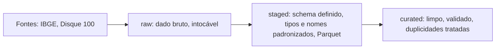

## Diagrama das camadas

## Camadas

Esta seção descreve como um arquivo real do projeto (Tabela 7334 do IBGE —
percentual de uso de Internet por grupo de idade) passa pelas três camadas.

### Raw
O arquivo entra como `.xlsx`, exatamente como baixado do SIDRA/IBGE, sem
nenhuma alteração. Ele tem os seguintes problemas:
- Cabeçalho espalhado em 3 linhas mescladas (`Nível`/`Cód.`/nome da localidade,
  depois `Ano x Grupo de idade`, depois `2025`, depois `Total`/`60 anos ou mais`)
- Uma coluna extra (G), sem propósito, resíduo da exportação do SIDRA
- A última linha da aba "Tabela" é o texto "Fonte: IBGE..." misturado como se
  fosse mais uma linha de dado
- Duas abas com propósitos diferentes ("Tabela" com os dados, "Notas" com a
  legenda de símbolos especiais do IBGE)

### Staged
Mesmo conteúdo, convertido pra formato de trabalho (`.parquet`), com:
- Cabeçalho único: `nivel, codigo, localidade, ano, grupo_idade, percentual`
- Coluna fantasma (G) descartada
- Tipos definidos: `percentual` como float, `codigo` como texto (tem zeros à
  esquerda em alguns códigos do IBGE)
- A aba "Notas" tratada separadamente, não misturada com os dados

### Curated
Dado limpo e validado:
- A linha de texto "Fonte: IBGE..." removida da tabela de dados
- Símbolos especiais do IBGE (`-`, `X`, `..`, `...`) convertidos pra valor
  ausente com motivo registrado (não é erro de leitura, é ausência com
  significado definido pelo próprio IBGE)
- Formato largo (uma coluna por faixa etária) convertido pra formato longo
  (uma linha por localidade + grupo de idade)
- Duplicidade checada (nenhuma encontrada nesse arquivo, mas o processo existe)

### Problema → camada que resolve

| Problema | Camada que resolve |
|---|---|
| Cabeçalho em 3 linhas | staged |
| Coluna fantasma (G) | staged |
| Duas abas com propósitos diferentes | staged |
| Linha de fonte misturada como dado | curated |
| Formato largo em vez de longo | curated |
| Símbolos especiais do IBGE | curated |

## Por que a camada raw é intocável

**Se uma regra de limpeza estiver errada 4 meses depois:** como a raw nunca é
editada, ela continua guardando o dado exatamente como veio do IBGE. Isso
significa que dá pra reprocessar a partir dela e corrigir a regra, sem
depender de memória sobre o que era o dado original nem de baixar de novo uma
fonte que pode ter mudado ou saído do ar. O princípio é o mesmo do
armazenamento de objetos: uma vez gravado, não se edita em partes — qualquer
correção parte de uma nova versão processada, nunca de alterar o que já foi
guardado como bruto.

**Se o IBGE tirar o arquivo do ar ou publicar uma versão revisada:** a raw
guardada localmente, com data de download e hash registrados, continua
garantindo que os resultados apresentados são reproduzíveis — mesmo que a
fonte original mude ou desapareça, existe uma cópia fiel do que foi
efetivamente usado na análise.

## O que acontece se a ingestão rodar duas vezes

Testei rodando o script duas vezes seguidas para o mesmo arquivo do IBGE.
O arquivo em `data/raw` não duplicou (foi sobrescrito no mesmo caminho), mas
o registro de procedência sim: `docs/procedencia.jsonl` ganhou duas entradas
para `ibge_internet_por_idade_tabela7334_2026-09-19.xlsx`, com o mesmo hash
SHA-256 (`c9d83075cb18510ba4144fe134b19badf496ca098a622572d38813b1ca66f678`)
e o mesmo tamanho (13.131 bytes), diferindo só no horário de download.

Isso é um problema real: o histórico de procedência fica com entradas
redundantes, e não há como distinguir, só olhando o registro, se o processo
rodou duas vezes por engano ou se o IBGE de fato publicou uma atualização.

**Caminho proposto:** antes de gravar um novo registro, calcular o hash do
arquivo e comparar com o último hash já registrado para aquele nome de
arquivo. Se for igual, não duplicar a entrada — só atualizar um campo de
"última verificação". Se for diferente, registrar como uma nova versão.

## Formato de armazenamento: CSV vs. Parquet (medido)

Medi tamanho em disco e tempo de leitura usando o arquivo real do IBGE
(53 linhas de dado após remover cabeçalho, coluna fantasma e linha de fonte),
salvo nos dois formatos, com tipos corretos por coluna (`codigo` mantido como
texto, colunas numéricas convertidas para número) e tempo de leitura medido
como média de 5 execuções:

| Formato | Tamanho em disco | Tempo de leitura (média) | Tempo de leitura (melhor) |
|---|---|---|---|
| CSV | 1,6 KB | 0,0041 s | 0,0012 s |
| Parquet | 4,4 KB | 0,0319 s | 0,0027 s |

**Resultado:** CSV venceu nos dois critérios, mesmo com tipos de dado
corretos. Isso não contradiz a teoria — confirma um limite dela: o Parquet
carrega metadados próprios (esquema, estatísticas por coluna, estrutura de
arquivo colunar) cujo custo fixo é maior que o arquivo inteiro quando o
volume de dado é pequeno (53 linhas, poucos KB). Esse custo fixo só se paga
quando há dado suficiente para amortizá-lo — CSV é texto puro sem overhead de
estrutura, então em arquivos pequenos ele naturalmente ganha em tamanho e
velocidade.

**Conclusão:** a vantagem do Parquet não é universal — ela aparece a partir de
um certo volume de dado, quando a economia de espaço (compressão colunar) e
de tempo (leitura seletiva de colunas, sem parsing de texto linha a linha)
supera o custo fixo de metadados. Com apenas 53 linhas, esse ponto de
equilíbrio nem chega perto de ser atingido. A base do Disque 100 (~1,79 GB,
2,8 milhões de linhas, 62 colunas) é o teste natural para observar o cenário
oposto, em que o Parquet deve se destacar claramente.

## Registro de procedência: formato proposto

Cada arquivo que entra no projeto gera uma entrada em `docs/procedencia.jsonl`
(um objeto JSON por linha), com os campos:

- `arquivo`: nome do arquivo na raw
- `fonte`: de onde veio (URL ou identificação da origem)
- `data_download`: data e hora em que foi baixado/copiado
- `tamanho_bytes`: tamanho do arquivo
- `n_linhas`: quantidade de linhas
- `sha256`: hash do conteúdo — é o que permite saber se o arquivo mudou desde
  então: mesmo hash significa mesmo conteúdo, hash diferente significa que a
  fonte mudou ou o arquivo foi atualizado.

Esse registro é preenchido automaticamente pelo script em `src/extract/`, no
momento em que o arquivo entra no projeto.
